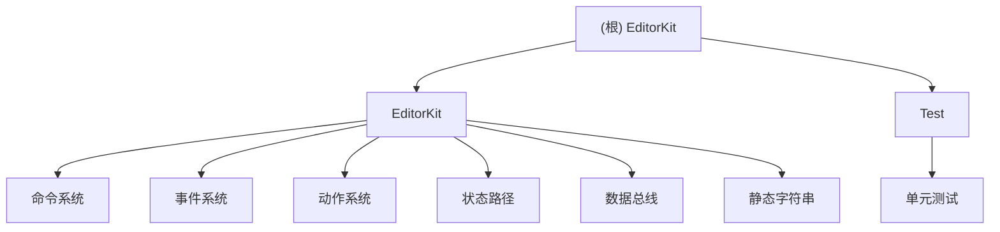

# EditorKit - C++编辑器工具包

## 项目愿景

EditorKit是一个现代化的C++编辑器工具包，提供了一套完整的设计模式实现，包括命令模式、事件系统、状态管理等核心组件。项目旨在为编辑器开发提供可复用、高性能的基础设施。

## 架构总览

EditorKit采用模块化设计，核心组件包括：

1. **命令系统** - 基于模板的命令模式实现，支持撤销/重做、命令合并
2. **事件系统** - 高性能事件总线，支持多播/单播模式
3. **动作系统** - 复杂的动作处理框架，支持验证器、处理器、监听器
4. **状态路径系统** - 树形状态管理，支持路径访问和事件监听
5. **数据总线** - 类型安全的数据共享机制
6. **静态字符串** - 高性能字符串标识符

## 模块结构图



## 模块索引

| 模块 | 路径 | 职责 | 关键文件 |
|------|------|------|----------|
| 核心库 | `EditorKit/` | 提供所有核心组件 | `CommandBase.h`, `ActionSystem.h`, `KEventBus.h` |
| 测试套件 | `Test/` | 单元测试和集成测试 | `EventBusTest.cpp`, `StatePathTest.cpp` |

## 运行与开发

### 构建系统
- **CMake**: 项目使用CMake作为构建系统
- **C++标准**: C++17
- **依赖**: Boost库（头文件依赖）

### 构建步骤
```bash
# 构建主库
mkdir build && cd build
cmake ..
cmake --build .

# 构建测试
cd ../Test
mkdir build && cd build
cmake ..
cmake --build .
```

### 开发环境
- **编译器**: 支持C++17的编译器（MSVC, GCC, Clang）
- **IDE**: Visual Studio, CLion, VS Code
- **调试**: 支持标准调试工具

## 测试策略

### 测试框架
- **Catch2**: 单元测试框架
- **测试类型**: 单元测试、集成测试

### 测试覆盖
- 事件总线功能测试
- 动作系统与事件总线对比测试
- 状态路径系统测试
- 静态字符串与事件总线集成测试

### 运行测试
```bash
cd Test/build
ctest --output-on-failure
```

## 编码规范

### 命名约定
- **类名**: PascalCase（如 `CommandBase`, `EventBus`）
- **函数名**: camelCase（如 `getData`, `setValue`）
- **变量名**: camelCase（如 `dataPtr`, `errorMessage`）
- **常量**: UPPER_SNAKE_CASE（如 `MAX_STACK_SIZE`）
- **模板参数**: PascalCase（如 `DataType`, `KeyType`）

### 代码风格
- 使用`#pragma once`作为头文件保护
- 模板实现放在头文件中
- 错误处理使用异常或返回错误码
- 智能指针管理资源生命周期

### 文档要求
- 公共API必须有文档注释
- 复杂算法需要解释性注释
- 模板参数需要说明用途

## AI使用指引

### 代码理解
- 项目基于现代C++设计模式
- 大量使用模板元编程
- 关注性能优化和类型安全

### 开发建议
1. **添加新功能**: 优先考虑作为现有系统的扩展
2. **修改现有代码**: 保持向后兼容性
3. **性能优化**: 关注热点路径，避免虚函数开销
4. **测试**: 新功能必须包含单元测试

### 调试技巧
- 使用事件系统的统计信息进行调试
- 利用数据总线的类型检查
- 状态路径系统提供树形可视化

## 变更记录 (Changelog)

### 2026-02-05 - AI上下文初始化
- 创建根级CLAUDE.md文档
- 创建模块级CLAUDE.md文档
- 生成.claude/index.json索引文件
- 添加Mermaid结构图
- 添加面包屑导航

### 近期提交
- cdc72c7: ActionSystem添加处理器不再抛出异常，而是返回无效Handler
- 8f051a3: CommandManager::Undo/Redo添加bool返回值
- a64d005: 链接boost库，移除RTTI&dynamic_cast依赖
- 8fcab62: 增加CommandBase&CommandManager命令模式模板基类
- 932ac90: 修复不允许事件重载情况下的参数匹配